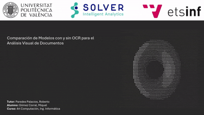
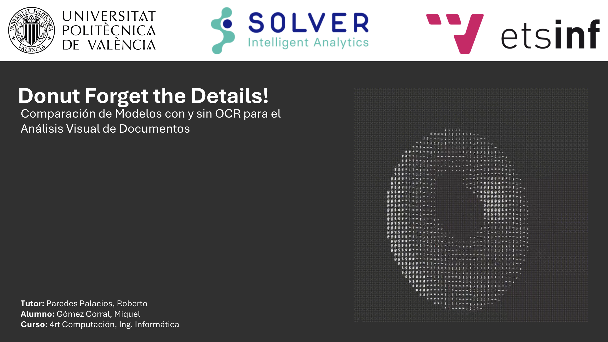
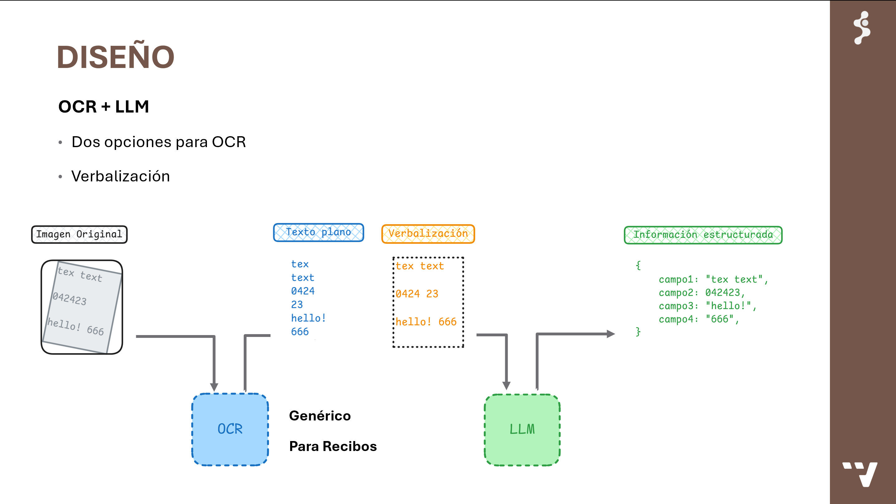

# TFG MIQUEL

Welcome to my bachelors degree thesis. This repo contains all the code used and eveloped to achieve the objective of the company to, among others, test differen Visual Document Understandin (VDU) methods to extract information from documents.

Here one can find code to test models:
- Provided by Azure, OCR and LLM. 
- A version of that OCR but finetuned for the task (train the model and just change the name in the file). 
- To finetune and test a version of the DONUT (Document Understanding Transformer)

There's code to used all the methods, extract their predictions and validate those based on the groundtruths.
Some of the requirements are libraries which are privated for company. In specifi 'ocr-llm-module'. If you want to use the repo, either get access to the company VPN or remove any usage of it. Then recreate it yourself.

## Repo structure
```
.
├── app
│   ├── =4.2.0
│   ├── data
│   ├── example.env
│   ├── scripts
│   │   ├── dataset
│   │   │   └── ...
│   │   ├── donut
│   │   │   └── ...
│   │   ├── ocr_llm
│   │   │   └── ...
│   │   └── testing_code.py
│   ├── setup.py
│   ├── src
│   │   ├── dataset
│   │   │   └── ...
│   │   ├── donut
│   │   │   └── ...
│   │   ├── notebooks
│   │   │   └── ...
│   │   ├── ocr_llm
│   │   │   └── ...
│   │   ├── outputs
│   │   │   └── ...
│   │   ├── README.md
│   │   └── utils
│   │       └── ...
│   └── testing_code.py
├── docker-compose.yml
├── Dockerfile
├── merge.sh
├── paper
│   └── ...
├── README.md
└── setup
    ├── compare_folders.sh
    ├── git.sh
    ├── requirements.txt
    └── setup.sh
```


# Setup

```
- docker compose up --build

- Go to the docker extension, rightclick on tfg_miquel-python > attach Visual Studio Cod
```

# Utils

- Copy all the files from one folder to another exluding git (used to sync company repo with github one)
```bash
  rsync -av --exclude='.git' TFG_Miquel/ ocr_tfg-miquel/
```

# Links
### Link to original repo

```
- https://github.com/clovaai/donut
```

### Link to example notebook

```
- https://huggingface.co/docs/transformers/main/en/model_doc/donutJ

- https://github.com/NielsRogge/Transformers-Tutorials/tree/master/Donut
```

---

<!-- portfolio-gallery:start -->
## Gallery

<p align="center">
  
  
  
  
  
  
  
  
  
  
</p>
<!-- portfolio-gallery:end -->
